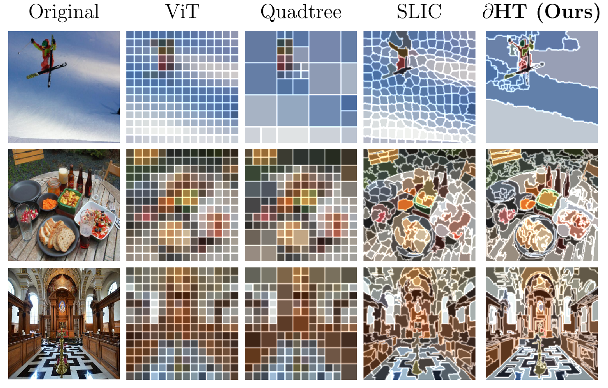
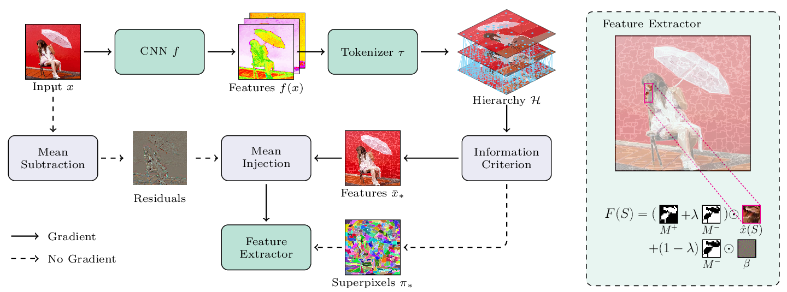
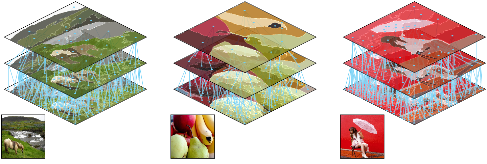

**Figure 1**: *Comparing spatial granularity in visual tokenizers. $\partial\text{HT}$ (right) provides an end-to-end learnable framework for multi-scale tokenization.*


Transformers have become the de facto architecture for all but a few data modalities.
The architecture is, however, contingent on the process of *tokenization*. 
Tokenizers for natural language are designed to compress text into morphemes and semantic subwords; minimal units aligned with meaning.
Yet in vision, tokenization is comprised of partitioning images into uniform square patches, ignoring semantic content and object boundaries in favor of computational convenience. 
This highlights a key incongruity; text tokenizers align with semantic units while patch-based vision tokenizers fragment objects without regard for their structure. 

Visual tokenization means discovering a discrete set of regions from a continuous, high-dimensional image, under strict compute and memory budgets, effectively solving segmentation, compression and representation learning all at once.
As opposed to 1D sequences, where one has a natural ordering and can pick breakpoints by cues such as whitespace and morpheme statistics, paritioning with spatial data is more complex and requires more complex solutions. 

## $\partial\text{HT}$: Motivation and Method

An effective visual tokenizer must unify precise semantic alignment, differentiability, and adaptive granularity. 
Our key insight is that hierarchical pixel-level partitioning can be formulated as a multi-scale model selection problem, and can be combined with differentiable mechanisms for end-to-end learning.
In this work, we introduce *differentiable hierarchical tokenization* ($\partial\text{HT}$); a visual tokenization framework that:
- **Hierarchical**: adaptive to variable information content in images via pruning with information criteria,
- **Granularity**: provides precise semantic boundaries for tokens, and yields raster-to-vector graphics conversion out-of-the-box,
- **Differentiability**: is end-to-end differentiable, with learning signals propagating all the way to encoder outputs,
- **Modularity**: is commensurable with standard ViT tokenizers via retrofitting.

Our proposed method builds on previous subobject level approaches [[Aasan et al. 2024](https://arxiv.org/abs/2408.07680), [Law et al. 2025](https://arxiv.org/abs/2412.04680), [Chen et al. 2025](https://arxiv.org/abs/2402.14327)] to provide the first fully end-to-end learnable tokenizer for ViTs. 
$\partial\text{HT}$ is not another ViT variant, but a fully modular tokenizer that can serve as a *plug-and-play* extension for pretrained models.


### High Level Overview


**Figure 2**: *Illustration of the $\partial\text{HT}$ tokenization and feature extraction pipeline. From an input image we produce a hierarchy of superpixel representations. An optimal segmentation is then selected from the hierarchy using information criteria, and features are extracted for each superpixel.*


$\partial\text{HT}$ produces adaptive tokens through four stages:

- *Feature projection*: We embed each pixel into a learned $d$-dimensional feature space using a lightweight CNN, establishing a similarity metric for subsequent grouping.

- *Hierarchical partitioning*: Starting from individual pixels, we iteratively merge similar adjacent regions to construct a complete hierarchy, capturing structure at multiple scales.

- *Optimal selection*: Information criteria identify the partition that best balances model fit against complexity, eliminating manual threshold tuning.

- *Differentiable extraction*: A mean-injection mechanism produces token features compatible with standard ViTs while enabling end-to-end gradient flow.

[In our paper](https://arxiv.org/abs/2511.02652) we develop the full construction in detail: how similarity kernels drive local edge contractions, how the CNN encoder supplies the feature geometry that guides merging, and how the resulting sequence of partitions forms a monotone path through the lattice of connected regionings on a grid. We also show how classical information criteria can be adapted to this discrete setting by estimating model fit through within-region variance and model complexity through the atomistic structure of the partition lattice. These pieces combine to give $\partial\text{HT}$ a principled way to decide *which* scale in the hierarchy best explains an image, and to feed that choice back into a fully differentiable feature extraction pipeline.


### Why Hierarchies?


**Figure 3**: *Detailed view of superpixel hierarchies for different images. Note that the higher levels often yield oversegmented regions, while lower levels yield undersegmented regions. By using model selection with information criteria, our model selects the most informative tokens over the full hierarchy.*

Visual tokenization is deceptively unconstrained, and there are combinatorially many ways to carve an image into connected regions, almost none of which are useful. The role of a hierarchy is to reduce the combinatorial search into a structured, manageable space.

A hierarchical merge process gives every image a single, monotone sequence of partitions, from pixels at the bottom to the whole image at the top. Each level is guaranteed to be a refinement of the next; a property backed formally by the connectivity–preserving edge contractions in our construction. This removes the need to search freely over $\Pi(V)$, the full lattice of partitions, and replaces it with a chain of paths.

Once the hierarchical structure is in place, classic model selection becomes much more well-defined. Information criteria can compare neighbouring levels, penalize unnecessary complexity, and identify the scale at which the image is best explained. 


## Retrofitting Pretrained Models

A practical tokenizer should ideally integrate with the vast ecosystem of pretrained ViT models already in use. $\partial\text{HT}$ is designed to be modular in precisely this sense. Instead of requiring a model to be trained from scratch with superpixel tokens, we align the tokenizer to an existing patch-based ViT and replace the original tokenizer without disturbing the backbone.

The key mechanism is the mean-injection formulation. During merging, region features are aggregated up the hierarchy, and once the hierarchy has been pruned, we project these features back to image space with a linear mapping $W$. When $W$ is initialized such that $W f^*(v) = \overline{x}^*(v)$ for every region, the reconstructed image matches the original input, making the presence of $\partial\text{HT}$ invisible to the ViT. 

We exploit this by *pretraining* the CNN encoder $f$ and the projection $W$ to reconstruct images as faithfully as possible. This aligns the feature geometry of $\partial\text{HT}$ with that of the pretrained model. Once aligned, fine-tuning proceeds exactly as in a normal ViT, except that the tokens now correspond to semantically coherent regions rather than fixed patches. Because the tokenizer is differentiable end-to-end, gradient flow naturally adapts the hierarchy, the region boundaries, and the token embeddings to serve the downstream task. 

## Raster-to-Vector Graphics Conversion


**Figure 3**: *Raster-to-vector graphics conversion using $\partial\text{HT}$. Starting from a learned superpixel hierarchy, we trace each region into a vector path, yielding an editable SVG-like representation without any extra training or supervision.*

Beyond serving as an adaptive tokenizer, $\partial\text{HT}$ also gives a surprisingly strong raster-to-vector graphics pipeline, without additional training or fine-tuning. Once we have a hierarchical superpixel partition, each region is already a clean, connected shape with a well-defined colour and boundary. By converting these regions into vector paths, we obtain scalable vector graphics without any task-specific training.

Concretely, we select an information-theoretically optimal partition, trace each superpixel boundary into a polygonal path, and export the resulting collection of regions as an SVG. Fine-scale regions capture texture and detail, while coarser regions handle large smooth areas, mirroring the hierarchy learned during tokenization. The result is a vector image that preserves semantic boundaries and local structure, remains editable in standard graphics tools, and scales to high resolutions without interpolation artefacts.


## Summary

In this work, we propose $\partial\text{HT}$ as a differentiable tokenizer that can be retrofitted to existing vision models. [Our paper](https://arxiv.org/abs/2511.02652) demonstrates that the resulting models produce competitive results in classification, segmentation, and provides benefits like high-quality automated raster-to-vector graphics conversion. We show that models can be effectively retrofitted with $\partial\text{HT}$ tokenizers, opening the door for modular tokenization methods for more effective vision modeling. *We hope our work contributes to inspiring more work on tokenization; an often overlooked but central component of modern vision models.*

### Citation


```
@inproceedings{aasan2025dht,
  title={Differentiable Hierarchical Visual Tokenization},
  author={Aasan, Marius and Hjelkrem-Tan, Martine and Catalano, Nico and Choi, Changkyu and Ram\'irez Rivera, Ad\'in},
  booktitle={The Thirty-ninth Annual Conference on Neural Information Processing Systems},
  year={2025},
  url={https://openreview.net/forum?id=y8VWYf5cVI}
}
```

